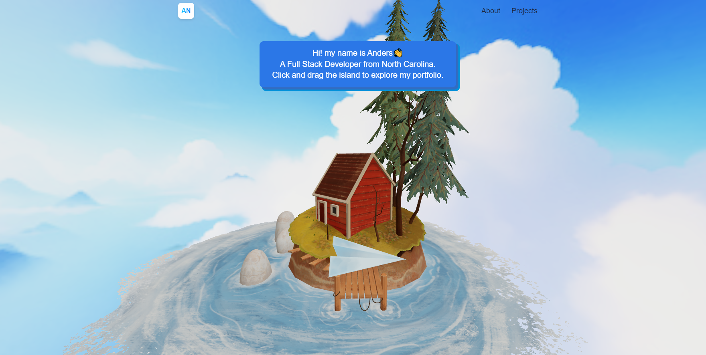

# Anders Newgard Fullstack Portfolio Built with React

## Table of Contents

* [Description](#description)
* [Technologies Used](#technologies-used)
* [Questions](#questions)

## Description

This is my Full Stack portfolio created with React! I had so much fun toying around with this. I used this project as a vehicle to challenge myself to build something different. Learned how to render 3D models and make them interactable in a browser environment. Navigate my projects and experience by spinning the paper plane around the island. Massive shoutouts to the artists on Sketchfab for the excellent open source models. 

[Click here to check out the deployed site](https://www.dersdevelops.com/)

A screenshot of the landing page:

## Technologies Used

React, Threejs for 3D components, TailwindCSS, emailjs, react router, react three/fiber and react three/drei to help with using threejs in react, and finally vite for the build.

## Questions

If you have any questions, please feel free to reach out to me at anewgard41@gmail.com. The contact form on my website sends emails there as well. You can also check out my [GitHub profile](https://github.com/anewgard41) if you'd like to see some of my other work. 

Thanks for taking the time to check out my portfolio. Cheers! 

